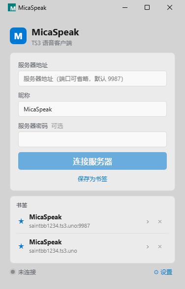
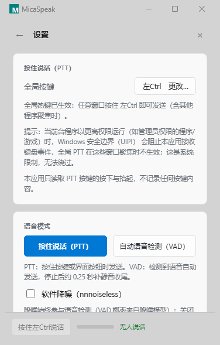

# MicaSpeak

<p align="center">
  
  &nbsp;&nbsp;
  
</p>

**MicaSpeak** 是一个面向 Windows 的非官方 TeamSpeak 3 第三方客户端，基于 Tauri 2 + React 构建，绿色版安装包不到 6 MB。

> MicaSpeak 与 TeamSpeak Systems GmbH 无关联；"TeamSpeak" 仅用于兼容性说明。本应用仅支持 TeamSpeak 3 服务器（TS5/TS6 不在支持范围）。

## 功能

- **连接与频道树** —— 书签（单击即连）、服务器备注、服务器密码；断线自动重连（指数退避 + 单飞闸门，杜绝重连风暴）
- **语音收发** —— Opus 编解码；按住说话（PTT，支持全局热键）与自动语音检测（VAD）两种模式；软件降噪（nnnoiseless）；输入/输出设备切换不断连
- **聊天** —— 频道/私聊多标签、未读红点、可收起的页内消息卡片
- **说话人悬浮窗** —— 有人说话时在屏幕指定位置显示昵称药丸，位置可拖动、自动保存
- **身份管理** —— 新建/导入/导出身份，与官方客户端互通（仅限无密码导出）；安全等级不足时一键升级
- **系统集成** —— 托盘（关闭即隐藏到托盘）、系统深浅色跟随、Win11 22H2+ Acrylic 系统材质（不支持的系统自动回退实体背景）
- **日志治理** —— 运行中按大小轮转 + 按库分级，磁盘占用上界约 16 MB

## 下载

前往 [Releases](https://github.com/Sixus/MicaSpeak/releases/latest)：

| 文件 | 说明 |
| --- | --- |
| `MicaSpeak-portable.zip` | 绿色便携版（推荐）：解压即用，含 README 与第三方许可清单 |
| `MicaSpeak-single.exe` | 单文件版：裸 exe，适合自用 |

SHA256 校验值见 Release 说明与资产旁的 `.sha256` 文件。

### 系统要求

- Windows 10 / 11（x64）
- [Microsoft Edge WebView2 (Evergreen)](https://developer.microsoft.com/microsoft-edge/webview2/) 运行时（Win11 一般已自带；缺失时应用会显示中文引导页）
- Acrylic 材质需要 Windows 11 22H2（build 22621+），更旧的系统自动回退实体背景

## 已知限制

1. 悬浮窗在独占全屏的游戏画面中不可见（Windows 系统限制）；无边框窗口化可正常显示。
2. 当前台程序以管理员权限运行时，Windows UIPI 会阻止全局 PTT 热键生效；请以相同权限运行本应用，或改用窗口内按钮说话。
3. 窗口失焦时系统材质会降饱和变灰——这是 Windows 材质的焦点两档设计，不是缺陷。

## 隐私与安全

- 身份私钥只保存在本机 `Data\identities\`，不会上传；界面与日志中的 Unique ID 均已脱敏。
- 全局 PTT 热键只读取设定按键的按下与抬起，不记录任何按键内容。
- 删除 `Data/` 目录即可完全恢复初始状态。

## 从源码构建

依赖：Node 18+ 与 pnpm、Rust stable（MSVC 工具链）、WebView2。

```bash
pnpm install
pnpm tauri dev      # 开发运行
pnpm tauri build    # 发行构建 → target/release/micaspeak.exe
```

绿色版打包：`powershell -ExecutionPolicy Bypass -File scripts\package-portable.ps1`（前置：已执行 `pnpm tauri build`）。

## 开发文档

`docs/` 保留了从 M0 到 M6 的完整任务卡：产品方案、开发总指南、每个里程碑的验收标准与已知坑；`logs/acceptance-capture/` 是 M6 的实机验收证据截图。

## 许可

本项目尚未选定开源许可证。发布物中附有第三方组件许可清单（`LICENSES/THIRD-PARTY-NOTICES.txt`）。
